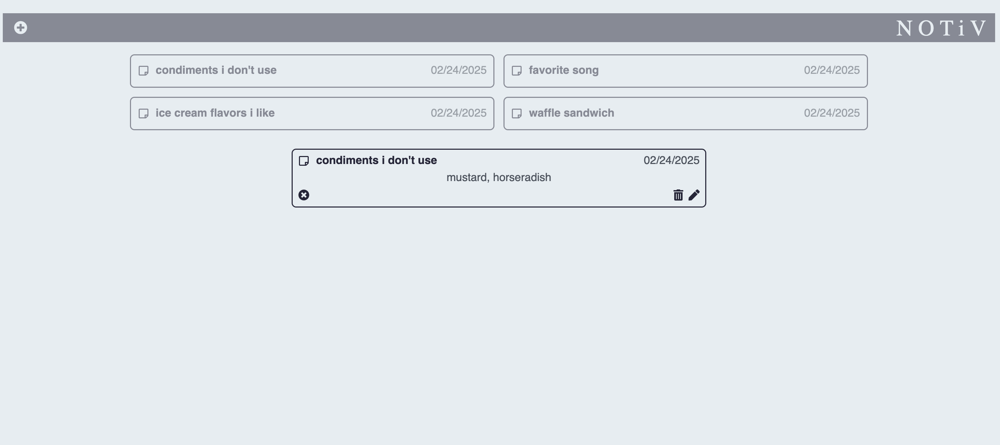

# Angela Griffin's Assessment Submission

## Introduction
Thank you for your consideration. This has been my first time working with React.js, and I am deeply grateful for the opportunity to demonstrate what I have been able to learn about this front-end framework over a matter of days. Due to this being my first experience with React, there are pieces of this assignment that I was unable to render into perfect mimicry of the mockup provided on the brief. This is also my first time writing a README.md file and using markdown formatting of this kind. Nevertheless, I appreciate the time taken to review my submission.

## Run Instructions
Loading the Github code into CodeSandbox should bring up a live preview of the application.

## Build Description
### Overview
I attempted to install React.js and its dependencies on my local machine, but ran into multiple errors. As such, I instead utilized the CodeSandbox environment mentioned by the tutorials on the React documentation site to build my project. Since this is my first foray into React, I was unsure what the best method of export would be, and therein decided to provide my finished code as-is. The official React documentation and various tutorials on certain pieces such as [how to create a modal view](https://github.com/trananhtuat/react-modal) were invaluable.

### Time Spent
The time I spent learning the basics of React itself was about 5 hours. From there, building this assessment took about 22 hrs.

### Screenshots
Here are screenshots of the three views. First, the notes list page:

Second, the note detail modal:

Third, the create/edit note modal:

## Conclusion
Thank you again for your time. This assessment taught me a lot about the basics of front-end development using React.js and API integration.